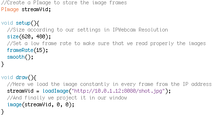
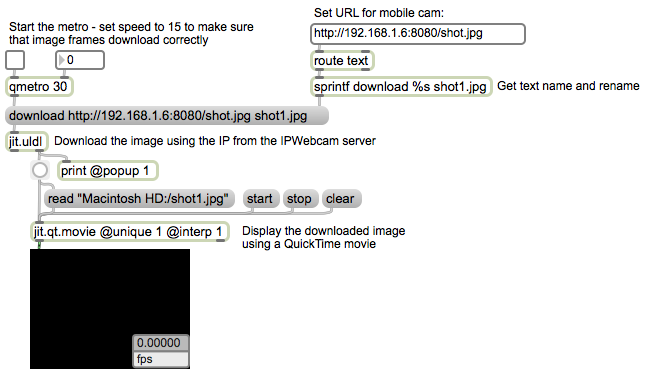

## Mobile Streaming Video

This tutorial demonstrates how to develop a streaming video application, using a mobile phone (Android OS in this case), 	[Processing](https://processing.org), and [Max](https://cycling74.com).

The system presented below was used [in this installation](https://soniconlab.com/portfolio-item/this-citys-centre), in which live videos taken from multiple mobile phone camera were streamed and received on the main site where a multiscreen visual performance took place.

To continue with this example, you would need to download and install the free application [IPWebcam](https://play.google.com/store/apps/details?id=com.pas.webcam&hl=en). This application is used to stream video from your mobile phone to a number of applications and frameworks i.e. Java, JavaScript, RTMP, VLC, Skype, or re-transmit to another mobile device. In the following example, we will use a local server to select and store the image frames that are created from the built-in camera of the mobile device.

Opening the application you may see the following screen, and we can proceed in configuring the application.

&nbsp;

Make sure that the Resolution (and Photo Resolution) is set to a medium level (a value of 640×480 should be enough), as bigger values may result to a slower playback rate. Set Quality from 50% up to 75% maximum. For the FPS Limit you could use No limit, or a simple 30fps shall be enough. You can select Prevent going to sleep if you want your device to stream non-stop until you quit, and the rest options could remain with their default values. Next, we Start server and we see a new window with our live camera video and two buttons on the top left and right of the screen. We select How do I connect? It is necessary to choose I’m using Wi-Fi router, as if we are not connected to a Wi-Fi router this will not work. Next window shows us the local IP of the device, and we need to ensure that we use this given address if we want to read the video frames to another system/device.

&nbsp;

Now that we broadcast video frames (as jpeg) in our network, we can begin developing in Processing or Max so that we can read these frames. In Processing, the code to read this address and put its contents in an image is as seen below:

&nbsp;

And following, is the code for Max, that uses the exact same approach.

&nbsp;

By using the streaming video, we can develop a range of media performances that utilize mobile phone content for the visual composition.
